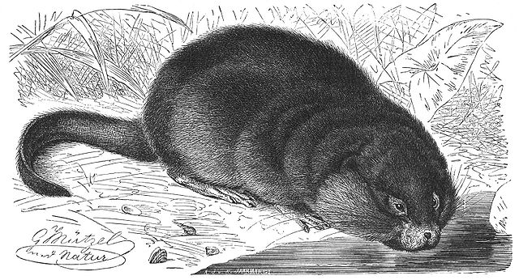

# MuscRat.jl

A Muon Simulation for Cosmic Ray Analysis Tasks

<!-- Couldn't figure out how to get markdown to resize the drawing w/o going to full HTML -->
<!--  -->
<p align="left">
    
</p>

The MuscRat project is designed to analyze the flux of cosmic rays in detectors. It was originally
designed to generate only muons, though some results of the PARMA code (Sato 2015) have been included
to help generate realistic distributions of µ±, γ, and e± from cosmic ray air showers.
This code runs in Julia 1.x (tested for 1.7 and up).

Analytic geometry allows MuscRat to compute the flux through muon detectors of simple, regular shape. Shapes implemented are:

* a sphere (`Sphere`)
* a cylinder (`Cylinder`) with axis along any cartesian axis (1, 2, or 3), including the specific cases of:
  * a vertical cylinder (`Vcylinder`)
  * a horizontal cylinder (`Hcylinder`)
* a rectangular prism (`Box`) oriented square to the cartesian axes

Particles are generated:
* The combined µ± flux is generated by a `CRMuonGenerator` from one of the two analytic formulas found in Su et al (2021): those of Reyna 2006 or Chatzidakis et al. 2015. At the moment, these are only sea-level values.
* The flux for particles at elevation 1675 meters (Boulder, Colorado) as computed by PARMA (Sato 2015). This uses a `ParmaGenerator(p::Particle)` where `p` is one of `MuscRat.Gamma`, `MuscRat.Electron`, `MuscRat.Positron`, `MuscRat.µplus`, or `MuscRat.µminus`. The PARMA calculations were run _outside_ of MuscRat and the results stored in `data/parma_electron.txt` and similar.
* The generator returned by `CRMuonGenerator` or `ParmaGenerator` is used like this
```julia
using Unitful, MuscRat
Nparticles = 1000000
g = ParmaGenerator(MuscRat.µplus)
# or
g = CRMuonGenerator(100, 100; Pmin=0.1u"GeV/c", Pmax=1000.0u"GeV/c")
p, cosθ = generate(g, Nparticles)
# p is an array of the momenta (units of GeV/c)
# cosθ is the corresponding array of cosine of the zenith angle
```

## References

* Su, N., et al., (2021). "A Comparison of Muon Flux Models at Sea Level for Muon Imaging and Low Background Experiments." _Frontiers in Energy Research_, **9**. [doi:10.3389/fenrg.2021.750159](https://doi.org/10.3389/fenrg.2021.750159)
* Reyna, D. (2006). "A Simple Parameterization of the Cosmic-Ray Muon Momentum Spectra at the Surface as a Function of Zenith Angle" [arXiv:hep-ph/0604145](https://arxiv.org/abs/hep-ph/0604145)
* Chatzidakis, S., Chrysikopoulou, S., Tsoukalas, L. H. (2015). "Developing a cosmic ray muon sampling capability for muon tomography and monitoring applications." _Nuclear Instruments and Methods in Physics Research, Section A_, **804** 33. [doi:10.1016/j.nima.2015.09.033](https://doi.org/10.1016/j.nima.2015.09.033)
* Sato, T., (2015). "Analytical Model for Estimating Terrestrial Cosmic Ray Fluxes Nearly Anytime and Anywhere in the World: Extension of PARMA/EXPACS." _PLOS ONE_, **10** e0144679. [doi:10.1371/journal.pone.0144679](https://doi.org/10.1371/journal.pone.0144679)